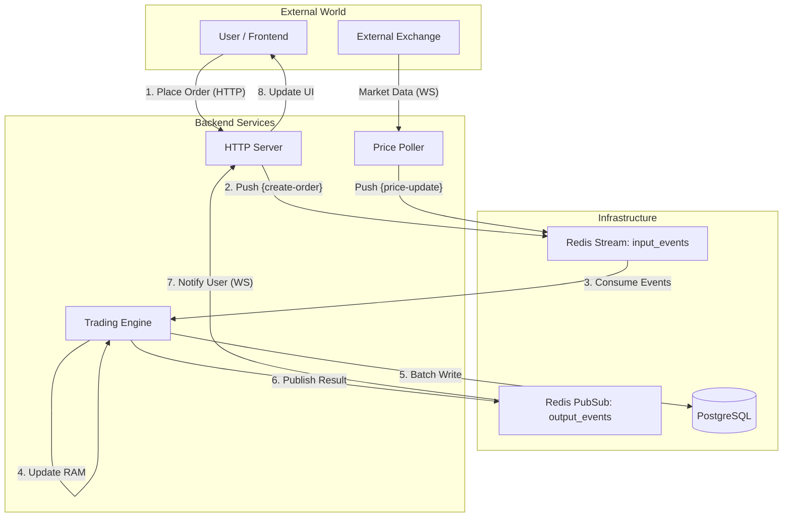

### system design of exness 

```mermaid
graph TD
    subgraph "External World"
        User[User / Frontend]
        Binance[External Exchange]
    end

    subgraph "Infrastructure"
        RedisStream[Redis Stream: input_events]
        RedisPubSub[Redis PubSub: output_events]
        DB[(PostgreSQL)]
    end

    subgraph "Backend Services"
        API[HTTP Server]
        Poller[Price Poller]
        Engine[Trading Engine]
    end

    %% Flows
    User -- "1. Place Order (HTTP)" --> API
    Binance -- "Market Data (WS)" --> Poller
    
    API -- "2. Push {create-order}" --> RedisStream
    Poller -- "Push {price-update}" --> RedisStream
    
    RedisStream -- "3. Consume Events" --> Engine
    
    Engine -- "4. Update RAM" --> Engine
    Engine -- "5. Batch Write" --> DB
    Engine -- "6. Publish Result" --> RedisPubSub
    
    RedisPubSub -- "7. Notify User (WS)" --> API
    API -- "8. Update UI" --> User
```
  