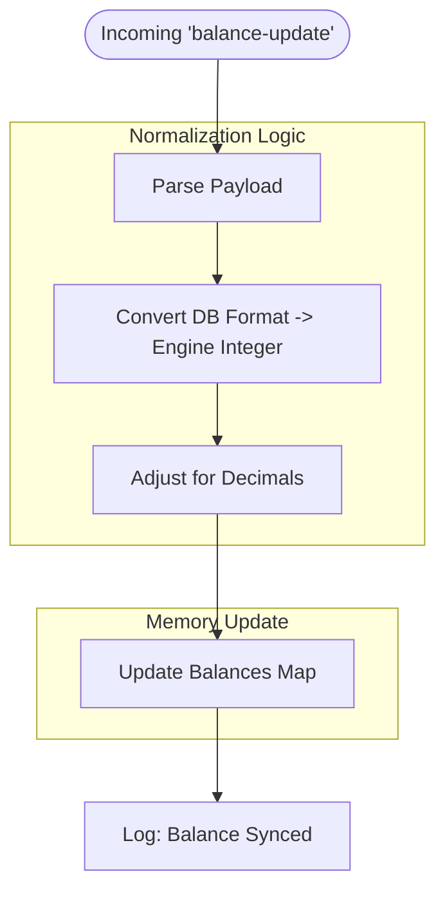

```mermaid
graph TD
    %% 1. Input
    Start([Incoming 'balance-update']) --> Parse[Parse Payload]

    %% 2. Logic
    subgraph "Normalization Logic"
        Parse --> Convert["Convert DB Format -> Engine Integer"]
        Convert --> Scale[Adjust for Decimals]
    end

    %% 3. Execution
    subgraph "Memory Update"
        Scale --> Update[Update Balances Map]
    end

    Update --> Log["Log: Balance Synced"]
```