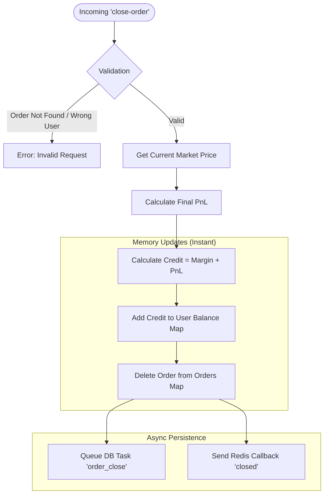

```mermaid
graph TD
    %% 1. Input
    Start([Incoming 'close-order']) --> Validate{Validation}

    %% 2. Checks
    Validate -- "Order Not Found / Wrong User" --> Error["Error: Invalid Request"]
    Validate -- "Valid" --> Calc[Get Current Market Price]

    %% 3. Math
    Calc --> PnL[Calculate Final PnL]
    PnL --> CreditCalc["Calculate Credit = Margin + PnL"]

    %% 4. Execution
    subgraph "Memory Updates (Instant)"
        CreditCalc --> Refund[Add Credit to User Balance Map]
        Refund --> Delete[Delete Order from Orders Map]
    end

    %% 5. Persistence
    subgraph "Async Persistence"
        Delete --> DB["Queue DB Task 'order_close'"]
        Delete --> Notify["Send Redis Callback 'closed'"]
    end
```