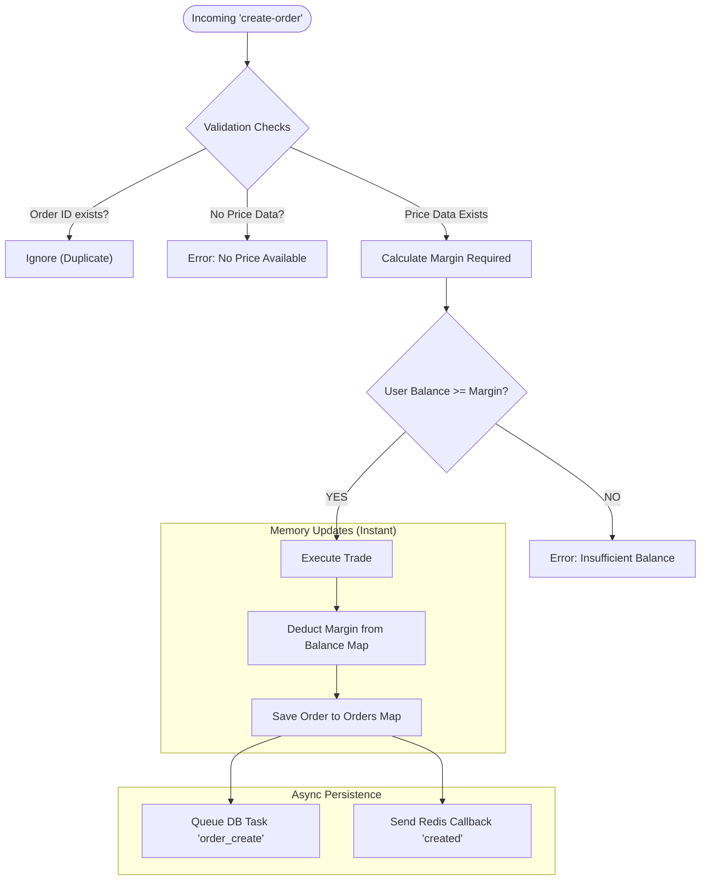

```mermaid
graph TD
    %% 1. Input
    Start([Incoming 'create-order']) --> Checks{Validation Checks}

    %% 2. Validation
    Checks -- "Order ID exists?" --> Ignore["Ignore (Duplicate)"]
    Checks -- "No Price Data?" --> Error1["Error: No Price Available"]
    Checks -- "Price Data Exists" --> Math[Calculate Margin Required]

    %% 3. Financial Check
    Math --> MoneyCheck{"User Balance >= Margin?"}
    MoneyCheck -- NO --> Error2["Error: Insufficient Balance"]
    
    %% 4. Execution
    MoneyCheck -- YES --> Execute[Execute Trade]

    subgraph "Memory Updates (Instant)"
        Execute --> Deduct[Deduct Margin from Balance Map]
        Deduct --> Store[Save Order to Orders Map]
    end

    %% 5. Persistence
    subgraph "Async Persistence"
        Store --> DB["Queue DB Task 'order_create'"]
        Store --> Notify["Send Redis Callback 'created'"]
    end
```