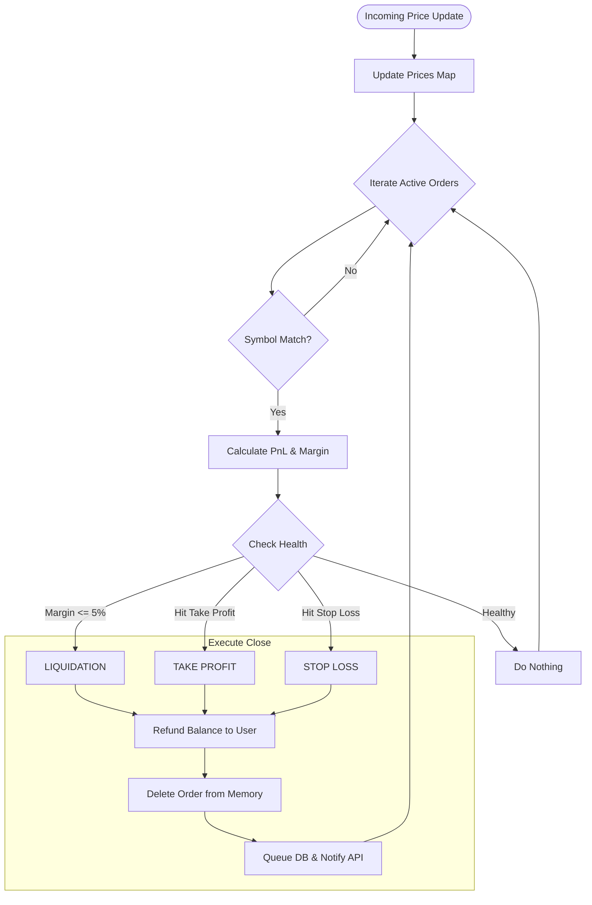

```mermaid
graph TD
    %% 1. Trigger
    Start([Incoming Price Update]) --> Update[Update Prices Map]
    
    %% 2. The Loop
    Update --> LoopStart{Iterate Active Orders}
    
    %% 3. Filter
    LoopStart --> Match{Symbol Match?}
    Match -- No --> LoopStart
    Match -- Yes --> Calc[Calculate PnL & Margin]

    %% 4. The Decision (Kill Switch)
    Calc --> Decision{Check Health}

    Decision -- "Margin <= 5%" --> Liq[LIQUIDATION]
    Decision -- "Hit Take Profit" --> TP[TAKE PROFIT]
    Decision -- "Hit Stop Loss" --> SL[STOP LOSS]
    Decision -- "Healthy" --> Safe[Do Nothing]

    %% 5. Action (Only if Closing)
    subgraph "Execute Close"
        Liq & TP & SL --> Refund[Refund Balance to User]
        Refund --> Delete[Delete Order from Memory]
        Delete --> DB[Queue DB & Notify API]
    end

    %% Loop Back
    Safe --> LoopStart
    DB --> LoopStart
```