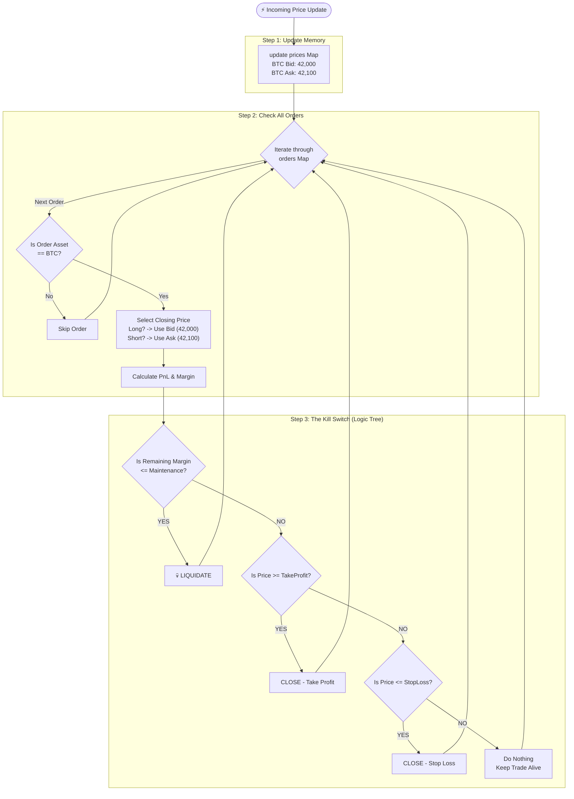

```mermaid
graph TD
    %% --- 1. The Trigger ---
    Input([⚡ Incoming Price Update])
    
    subgraph "Step 1: Update Memory"
        Store[update prices Map\nBTC Bid: 42,000\nBTC Ask: 42,100]
    end

    Input --> Store
    Store --> LoopStart

    %% --- 2. The Loop ---
    subgraph "Step 2: Check All Orders"
        LoopStart{Iterate through\norders Map}
        
        ConditionSymbol{"Is Order Asset\n== BTC?"}
        
        Skip[Skip Order]
        
        CalcPrice["Select Closing Price\nLong? -> Use Bid (42,000)\nShort? -> Use Ask (42,100)"]
        
        CalcPnL[Calculate PnL & Margin]
        
        LoopStart -->|Next Order| ConditionSymbol
        ConditionSymbol -- No --> Skip
        Skip --> LoopStart
        ConditionSymbol -- Yes --> CalcPrice
        CalcPrice --> CalcPnL
    end

    %% --- 3. The Logic ---
    subgraph "Step 3: The Kill Switch (Logic Tree)"
        CalcPnL --> CheckLiq{"Is Remaining Margin\n<= Maintenance?"}
        
        CheckLiq -- YES --> LIQ[💀 LIQUIDATE]
        
        CheckLiq -- NO --> CheckTP{"Is Price >= TakeProfit?"}
        
        CheckTP -- YES --> WIN[ CLOSE - Take Profit]
        
        CheckTP -- NO --> CheckSL{"Is Price <= StopLoss?"}
        
        CheckSL -- YES --> LOSS[ CLOSE - Stop Loss]
        
        CheckSL -- NO --> LIVE[ Do Nothing\n Keep Trade Alive]
    end

    %% --- Return to Loop ---
    LIQ --> LoopStart
    WIN --> LoopStart
    LOSS --> LoopStart
    LIVE --> LoopStart
```